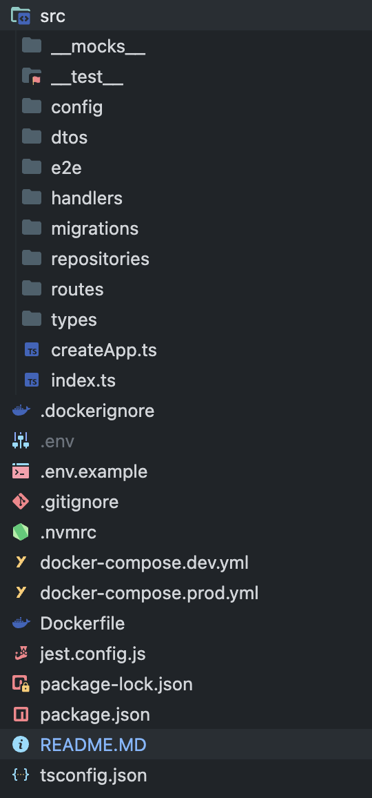
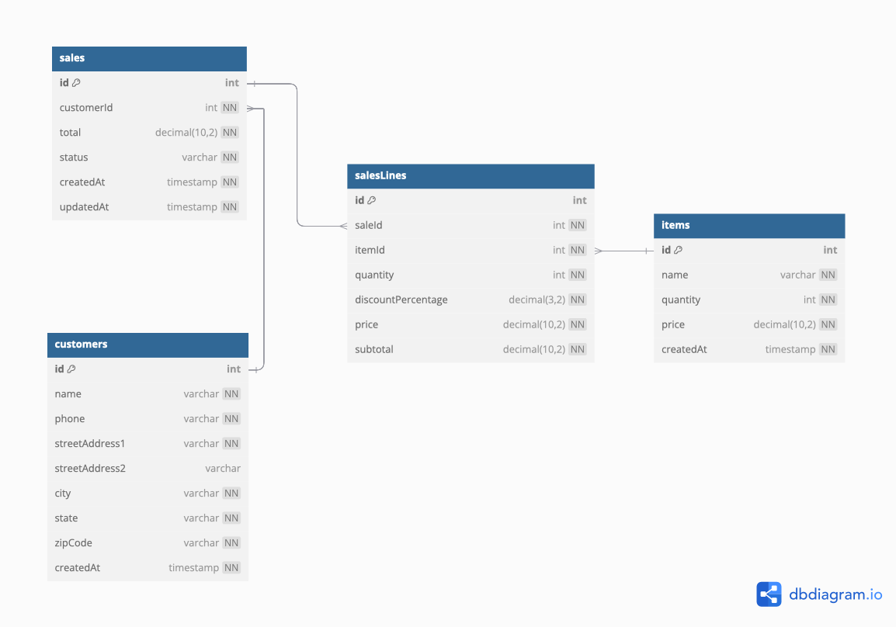
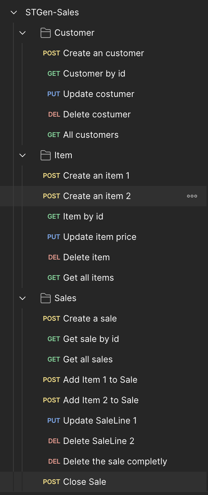

# Step by step
A repository for the technical assessment for the backend NodeJS Developer position at STGenetics, by Juan Diego Trujillo.

# Overview
## Model Overview

The application follows a layered architecture, using repositories, handlers, and an Express-based application layer to manage operations efficiently.

- _Repository Layer_: Encapsulates all database operations using Kysely, providing type-safe interactions with tables like customers, items, sales, and salesLines. This layer isolates data access and enforces key rules, such as checking item stock and calculating totals.

- _Handler Layer_: Manages HTTP requests, routes, and responses, acting as the intermediary between the client and repository functions. Handlers apply business logic, validating data and sales rules. For instance, createSalesOrder verifies customerId before creating a sale, and addSaleLine checks stock and sale status before adding items.

- _Application Layer_: Built with Express, it initializes routing, middleware, and server configuration, exposing the RESTful API. The app layer serves as the entry point, coordinating the database connection and API route setup.

## Project structure

The project structure is organized to ensure maintainability and scalability. The repository is divided into distinct layers, each with a specific responsibility, making it easier to manage and extend the codebase. This approach helps in isolating concerns and promotes a clean architecture.



In a typical npm and TypeScript project, the project structure might include directories such as `src` for source code, `tests` for test files, and `dist` for compiled output. Configuration files like `package.json` for npm dependencies and scripts, `tsconfig.json` for TypeScript compiler options, and `.eslintrc` for linting rules are usually placed in the root directory (I have omited it for now). This organization helps in separating concerns and maintaining a clean and manageable codebase.

For instance, the `src` directory contains all the TypeScript files that define the application's logic, while the `tests` directory holds unit and integration tests to ensure code quality. The `dist` directory is used to store the compiled JavaScript files that are generated after the TypeScript code is transpiled. Additionally, configuration files in the root directory provide essential settings and dependencies required for building, running, and maintaining the project. *This project runs over Docker!*

## Database Structure

_Relationships_: sales link to customers, and salesLines link to sales and items, storing quantities, discounts, and subtotals.



In our sales model, we use two main tables: sales and salesLines, to effectively manage the order process. Here’s a brief rationale:

### sales Table

The sales table represents each individual sale or order. It includes:

- id: Unique identifier for each sale.
- customerId: References the customer placing the order.
- status: Tracks if the sale is open or closed, preventing modifications once finalized.
- createdAt and updatedAt: Timestamps to track the sale’s lifecycle.

Using a separate sales table allows us to store overall order information and status without being tied to individual items within the order.


### salesLines Table

The salesLines table stores each item in a sale. It includes:

- id: Unique identifier for each sale line.
- saleId: Foreign key referencing the sales table to link each item to its sale.
- itemId: References the specific item/product being purchased.
- quantity: Number of units for the item in this order.
- discountPercentage: Discount applied to the item, allowing for real-time calculation.
- originalPrice: Snapshot of the item’s original price at the time of sale.
- subtotal: Calculated as originalPrice * quantity * (1 - discountPercentage), storing the final item total after any discounts.

## Tech stack

- **Node.js**: Provides high performance and scalability for server-side applications with a non-blocking architecture.
- **Express**: A simple and flexible framework for quickly building APIs and web applications.
- **MySQL**: Reliable and efficient relational database management for complex queries and structured data.
- **Kysely**: Type-safe SQL query builder that enhances code quality and reduces runtime errors.
- **TypeScript**: Adds static typing to JavaScript, improving code maintainability and developer productivity.
- **Docker**: Ensures consistent deployment across environments by containerizing applications and their dependencies.


## How to Use This Project with Docker
To run this project using Docker, follow these steps:

1. **Set Up Environment Variables**:
	Rename the file called __.env.example__ to __.env__. It's almost ready to run, so you should not change any of the current variables, at least you have other projects running. 


3. **Build and Run the Docker Containers**:
	Use Docker Compose to build and start the containers.
	```sh
	docker compose  -f ./docker-compose.dev.yml up -d --build
	```

4. **Access the Application**:
	Once the containers are up and running, you can access the application at `http://localhost:3000`.

5. **Run Database Migrations**:
	The migrations should run automatically, so you don't need to do anything.

6. **Stop the Containers**:
	When you are done, you can stop the containers with:
	```sh
	docker compose  -f ./docker-compose.dev.yml down
	```

## Business Logics
### Lyfecicle
- **Order Creation**: When a new order is created, an entry is added to the sales table with a unique id, customerId, status set to open, and timestamps for createdAt and updatedAt.

- **Adding Items**: Items related to the order are added to the salesLines table, each linked to the sales table via a foreign key (likely the id from the sales table).

- **Order Modification**: As long as the status of the order in the sales table is open, items can be added, modified, or removed from the salesLines table.

- **Closing the Order**: When the order is finalized, the status in the sales table is updated to closed. This prevents any further modifications to the order or its items.

- **Lifecycle Tracking**: The createdAt and updatedAt timestamps in the sales table help track when the order was created and last modified, providing an audit trail.

### Restrictions
- **Single Order per Item Type**: Each salesLines entry can only have one type of item per order. This means that if you want to add multiple quantities of the same item, you must update the existing salesLines entry rather than creating a new one.

- **Update Requirement**: If you need to modify the quantity or details of an item in an order, you must call the update function on the existing salesLines entry. Attempting to add a duplicate item type without updating will throw an exception.

- **Immutable Closed Orders**: Once the status of an order in the sales table is set to closed, no further modifications can be made to the order or its items. This ensures the integrity and finality of the transaction.

## How to Test It
I have developed some unit tests and integration tests for the application. However, due to recent changes, some tests have broken. I am working on fixing them before the repository is reviewed.

In the meantime, you can test the application using a Postman collection I have prepared. It's not fully automated, so you may need to adjust some IDs, but nothing critical. The collection is available in the `docs` folder for import.



## Improvements
- **Parameter Validation**: Add a library for parameter validation in the services. Although I have implemented some checks, they could be done in a cleaner way.
- **Testing**: Enhance the testing to ensure high quality.
- **Error Handling**: Improve error handling. Currently, there are some validations that should be added to avoid errors. Additionally, a middleware should be added to handle 500-type errors when they occur.
- **Foreign Key Restrictions**: Verify foreign key constraints. Some foreign keys have not been applied even though they were explicitly added. This needs to be checked to ensure consistency and good transactional integrity.
- **Transactions**: Mark certain operations as transactions to ensure consistency.
- **Edge Cases**: Address edge cases, such as what happens if an item's price changes after it has already been added to a sale.