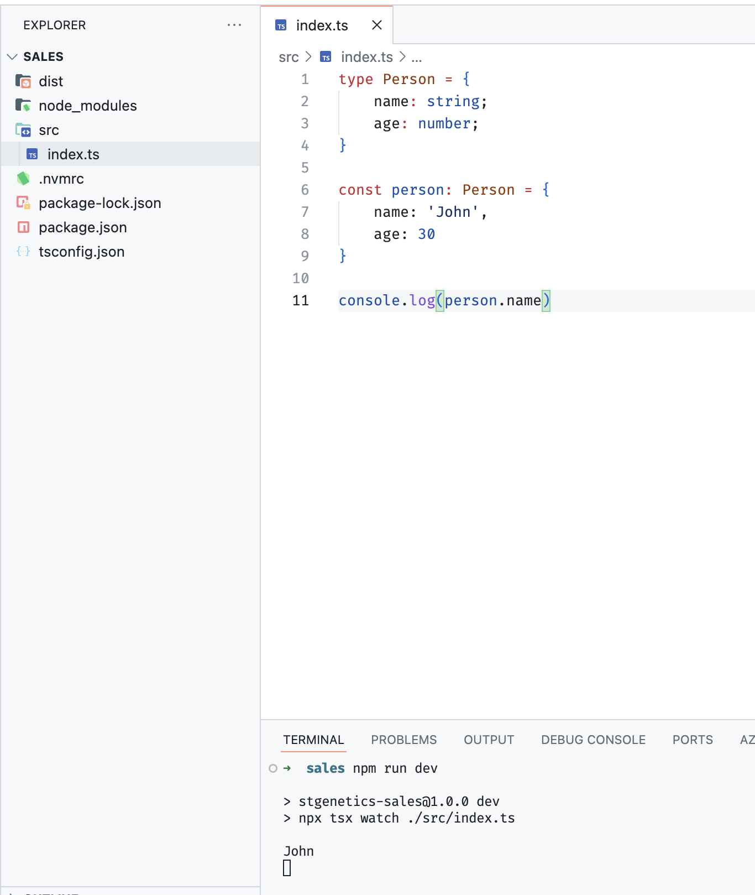

# Step by step

**TL;DR**: A repository for the technical assessment for the backend NodeJS Developer at STGenetics.

## Motivation 
Beforehand I would like to say that, as JS/TS Developers, right now we are living a wonderful moment around the tech ecosystem. We have options like Deno or Bun as JS Runtime alternatives. Also, the new releases of NodeJS and their experimental support for native TS types, the new version of TS 5.7 Beta release or even the new JS Proposals from TC39 which give us several new features for the language.

However, we have to have in consideration the requirements for the project, the type of problem we are going to solve and the advantages and disadvantages for one solution to other. In this case, we will use a classical stack and tools to resolve the assessment.

- Nvm for handle Node versions. 
- NPM as our main package manager. 
- NodeJS LTS (v20.18.0) as JS/TS runtime. 
- Typescript (v5.6.3) as programming language
- Express.js (v5.0) as minimal web framework. 

So, the first step is the configuration process.

## Configuration
First, let’s set the current LTS version at the, the create the  which version we are going to use: 

	nvm use —lts 
	node -v > .nvmrc
	nvm use

Then, we are going to init our npm package

	npm init

We add some very basic data about the project. 

Let’s install TS tooling we are going to need to our repo, as development tools:

	npm install -D typescript @types/node tsx

Now, it’s time for select the tsconfig.json. As you may know, sometimes this is a little big controversial, so we are selecting some basic configuration from some sources: 

* https://www.typescriptlang.org/docs/handbook/modules/guides/choosing-compiler-options.html
* https://github.com/tsconfig/bases/?tab=readme-ov-file
* https://www.totaltypescript.com/tsconfig-cheat-sheet

You be able to see the result in the repo with their comments to explain the decisions. 

Let’s add our .src folder with a basic script. 
	mkdir ./src
	touch ./src/index.ts

I also add a very basic gitconfig with .gitignore file. 

In the packaje.json let’s add two main scripts to run easily the app:

	"start": "node dist/index.js",
    	“dev": "npx tsx watch ./src/index.ts"


Now, let’s add some basic to our project and test if it works:



So, yeah! We have our skeleton to start working. 

## Express Setup 

For creating our app, let's setup a very basic express config:

     npm install express 
     npm install @types/express

Then, let's modify our index.ts to add the server initialisition and a basic "Hello world" service. 

```ts
import express, { Request, Response } from 'express';

const app = express();
const PORT = process.env.PORT || 3000;

app.get('/', (req: Request, res: Response) => {
    res.send('Hello World');
});

app.listen(PORT, () => {
    console.log(`Server is running on port ${PORT}`);
});
```

If everything is okey, we shoud have our server running on http://localhost:3000. 


So far so good, let's continue.

## Docker
So, let's dockerize our app, including the database. I have already selected MySQL, I think the election really doesn't matter too much, but I have also experience with PostgreSQL and MongoDB.

So, first step: create the Dockerfile

	touch Dockerfile


## Database
For the database, I take the decision to go with Kysely, an Type-Safety query build for typescript. I know that sequalice and Prisma are very popular ORMs and they always have been selected in the 'standard' stack. However, I found this tools very useful and fits perfect for our current task. 


## Cust Table
